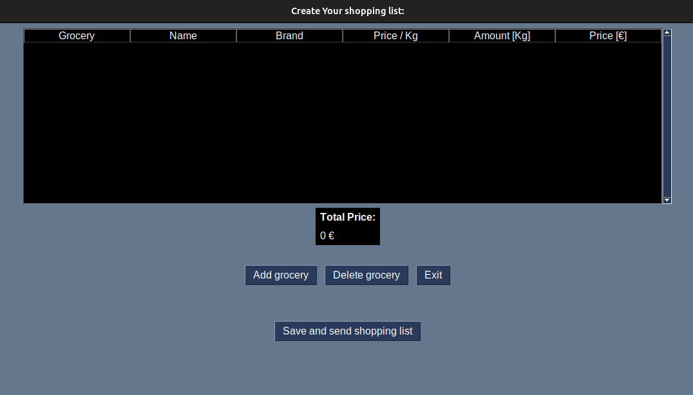
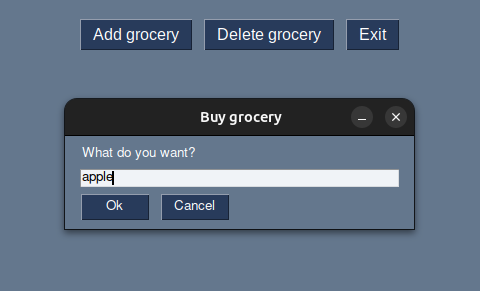
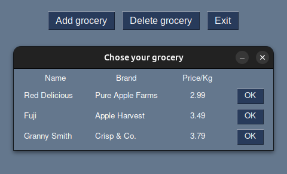
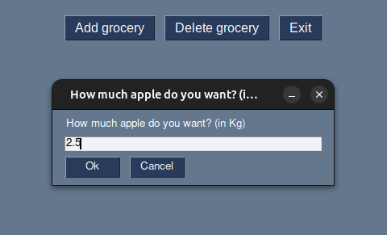
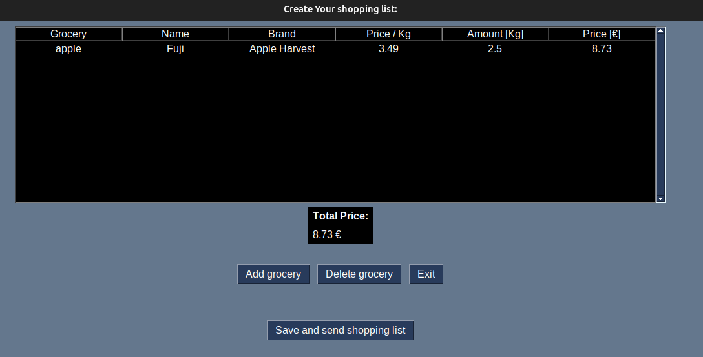

# shopping list

## Create a shopping list from user entries and automatically calculate the price for the products. Forward the shopping list to the user.

Add groceries to the shopping list using the "add grocery" button.

Chose the grocery from a list presented to you:

Define the amount of groceries you want to purchase:

Your choice is added to the grocery list

