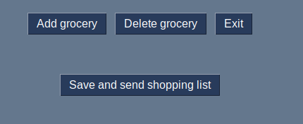

# shopping list

## Create a shopping list from user entries and automatically calculate the price for the products. Forward the shopping list to the user.
### Execute the main.py file, in order to start the program:

Add groceries to the shopping list using the "add grocery" button.

Chose the grocery from a list presented to you:

Define the amount of groceries you want to purchase:

Your choice is added to the grocery list

If more groceries are added, the total price will be updated:

Delete a choice if you have changed your mind by using the "Delete Grocery" button.

The grocery will be deleted from the table and the total price is updated.

Finalize shopping list by pressing the "save and send shopping list" button:

Chose a name for your shopping list. A file by this name with the shopping list will be created:

Enter your Email Adress:

The displayed shopping list will be emptied:

A text file with the name of the shopping list is created in the lists folder

You have received an Email of the shopping list:

